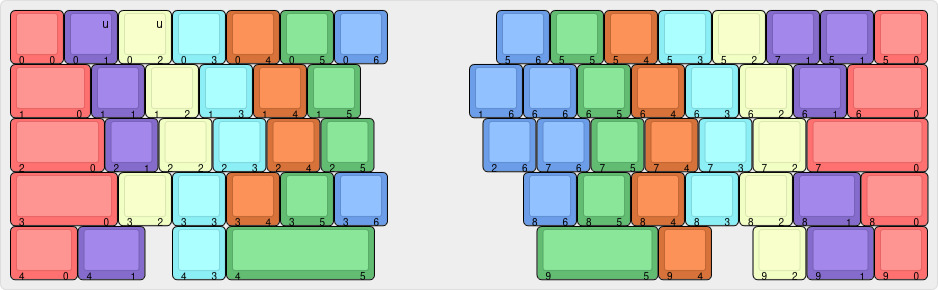

# "fAuxLICE"

An 3D printable Alice-like mechanical keyboard.


## Layout


[Keyboard Layout Editor](http://www.keyboard-layout-editor.com/#/gists/7f17a55de07d88c1f975089b07f053b1)

## Components

### Required components

- 1x Arduino Pro Micro
- 64× switches of your choice
- 108-key keycap set
- 64× diodes
- Wires
- 14× M3×16 countersunk screws
- 2× M3×12 countersunk screws

### Optional components

- 4× plate-mounted Costar stabilizers
- 1× M3×8 countersunk screw
- 1× M3×10 countersunk screw
- 1× M3×12 countersunk screw
- 1× M3×16 countersunk screw
- 1× M3×20 countersunk screw

The optional components are for reinforcing the top halves. They're not required.  
A proper glue up would be probably enough for the two halves.

## Wiring diagram

The keyboard is wired in a 10-row, 7-column configuration.  
We have to solder a cable between the left and right columns as shown in the picture.


The way to connect the rows/columns to Pro Micro are defined in `keyboard.json`:

```
"rows": ["B5", "B4", "E6", "D7", "C6", "F4", "D4", "D0", "D1", "D2"],
"cols": ["B6", "B2", "B3", "B1", "F7", "F6", "F5"]
```

## Build notes

The accent pieces have an extra 5mm sticking out. You should be able to cut them to the perfect length, and make the transitions between the two seamless. Glue the accent pieces to the bottom halves.

The halves do not lock into each other. I used a combination of glue and diode trimmings melted into the plastic.

## Firmware

The firmware included is for the Arduino Pro Micro board.  
You can just flash `fauxlice_vial.hex` with [QMK-Toolbox](https://qmk.fm/toolbox) or [QMK-CLI](https://docs.qmk.fm/cli).

## License

This project is licensed under the MIT license. See the `LICENSE.md` for more details.

## Special thanks to

- [zykrah](https://zykrah.me/)
- [mnt](https://www.instagram.com/mnt.designs/)

---

todo:

- usbc hole down 2mm
